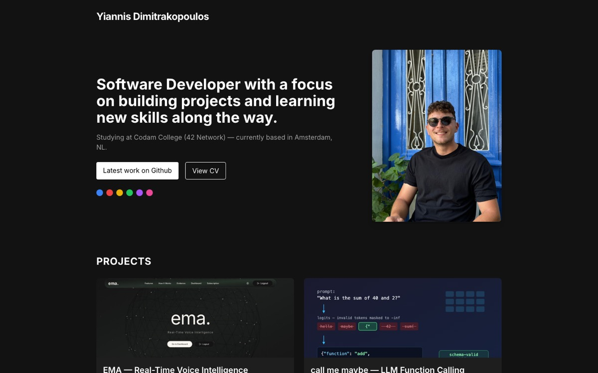

# Yiannis Dimitrakopoulos — Portfolio

Personal portfolio website. Dark single-page design built with Nuxt 3 and Tailwind CSS, deployed as a static site on Netlify.

🔗 **Live:** https://yiannis-portfolio.netlify.app

## Stack

| Layer | Technology |
|---|---|
| Framework | Nuxt 3 (Vue 3, Composition API) |
| Language | TypeScript |
| Styling | Tailwind CSS |
| Fonts | Inter via `@nuxtjs/google-fonts` |
| Deploy | Netlify (static, auto-deploy on push to `main`) |

## Featured projects

- **call me maybe** — LLM function calling via constrained decoding
- **RAG Against the Machine** — BM25 retrieval over the vLLM codebase
- **Constrained GraphRAG** — graph-augmented retrieval, Neo4j + Outlines-constrained extraction over vLLM
- **Visual Lab** — interactive math, algorithms, data structures, and concurrency playground
- **Medlake Training** — freelance website redesign (Nuxt 3, Three.js, CMS, multilingual)
- **Codexion** — dining-philosophers concurrency simulation in C

## Contact

- yiannisdimitrakopoulos@outlook.com
- [LinkedIn](https://www.linkedin.com/in/dim-yiannis/)
- [GitHub](https://github.com/DimYiannis)
